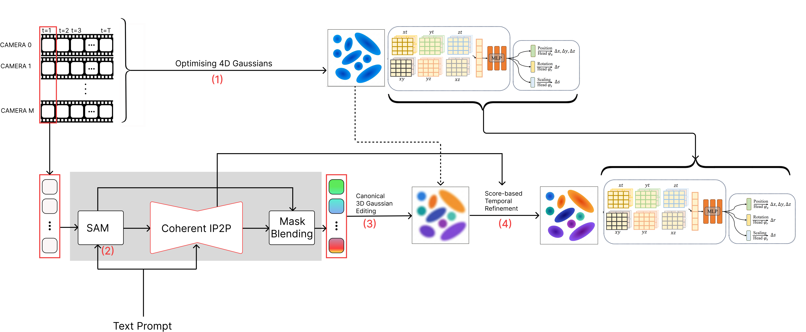

# OBEDIT-4D: Object-Centric Editing of 3D Dynamic Scenes via Text Prompts

## Description

OBEDIT-4D is a training-free pipeline for **object-centric, text-driven editing
of dynamic 4D scenes**. It is built on top of the efficient
[Instruct-4DGS](https://github.com/) / [4D Gaussian Splatting
(4DGS)](https://github.com/hustvl/4DGaussians) architecture and addresses the
core limitation of prior 4D editing methods, which apply diffusion updates
_globally_ and therefore suffer from background drift, temporal flickering, and
identity loss in non-target regions.

The key idea is **image-space masked blending**: after a multi-view-consistent
diffusion editor (Coherent-IP2P) edits a canonical view, the edited output is
blended with the original image using a binary object mask obtained
automatically from [Grounded-SAM](https://github.com/IDEA-Research/Grounded-Segment-Anything).
Only the masked (target) pixels keep the edit; all background pixels are
restored from the original image before supervising the Gaussian update. A
Score Distillation Sampling (SDS) stage then refines residual temporal
artefacts. Because edits are pre-localised, SDS converges in roughly 800
iterations.

On the Neural 3D Video (N3DV) benchmark, OBEDIT-4D improves PSNR by up to
**9.91 dB** and reduces LPIPS perceptual distance by up to **63.5%** relative to
prior 4D editing baselines, while maintaining comparable runtime.

---

## Dataset Information

- **Dataset:** Neural 3D Video / Plenoptic Video Dataset (**N3DV**)
- **Source URL:** https://github.com/facebookresearch/Neural_3D_Video
- **Reference / DOI:** Li _et al._, _Neural 3D Video Synthesis from Multi-view
  Video_, CVPR 2022. arXiv:2103.02597, DOI: `10.48550/arXiv.2103.02597`
- **Contents:** Time-synchronised, calibrated multi-view RGB video from 18–21
  cameras. Scenes used in this project include `cook_spinach` and `sear_steak`
  (each featuring combined rigid and non-rigid human–object motion).
- **License:** The N3DV dataset is released by its authors for research
  purposes; please consult the upstream repository for the exact terms.

For convenience, pre-processed inputs and a trained 4DGS output for the
`cook_spinach` scene can be reused following the base Instruct-4DGS instructions
(initial point cloud `points3D_downsample2.ply` and the trained `point_cloud/`
directory).

---

## Code Information

The repository provides an end-to-end implementation of the four-stage
pipeline:

1. **Stage 0 — 4D reconstruction:** train a 4DGS model on the multi-view video.
2. **Stage 1 — Mask generation:** generate binary object masks at `t = 0` with
   Grounded-SAM from a free-form text query.
3. **Stage 2 — Masked diffusion editing:** edit the canonical 3D Gaussians with
   Coherent-IP2P and confine changes via image-space mask blending.
4. **Stage 3 — Temporal refinement:** refine with SDS across timesteps.

Representative entry points (built on the Instruct-4DGS layout):

- `run_instruct_4dgs.sh` — driver script for the editing pipeline.
- `edit_3d.py` — masked canonical 3D Gaussian editing (see the logic around
  line 247 for handling scenes with missing camera views).
- `render_edited4d.py` — render the edited 4D scene from a saved point cloud.

---

## Requirements

The software stack mirrors the base 4DGS / Instruct-4DGS environment:

- **OS:** Ubuntu Linux
- **Hardware:** a single NVIDIA T4 GPU (16 GB) is sufficient
- **Python:** 3.7 (conda environment, e.g. `Gaussians4D`)
- **Deep learning:** PyTorch 1.13.1 compiled against CUDA 11.6
- **Submodules:** differentiable (depth-)Gaussian rasteriser, `simple-knn`
- **External models:** Grounded-SAM (Grounding DINO + SAM), Coherent-IP2P
  diffusion weights
- **Other:** COLMAP (for camera poses and point clouds), plus the packages
  listed in `requirements.txt`

```bash
# 1. Set up the base 4DGS environment first
git clone https://github.com/hustvl/4DGaussians
cd 4DGaussians
git submodule update --init --recursive
conda create -n Gaussians4D python=3.7
conda activate Gaussians4D
pip install -r requirements.txt
pip install -e submodules/depth-diff-gaussian-rasterization
pip install -e submodules/simple-knn

# 2. Then install this project's additional packages
conda activate Gaussians4D
pip install -r requirements.txt
```

---

## Usage Instructions

### 1. Prepare the data

Download N3DV from the official source above and process it following the 4DGS
guide (see the Methodology section). Place the pre-processed assets, e.g.:

- Initial point cloud `points3D_downsample2.ply` →
  `./data/dynerf/<scene>/`
- Trained 4DGS output `point_cloud/` →
  `./output/dynerf/<scene>/`

### 2. Run the editing pipeline

```bash
# run_instruct_4dgs.sh [dataset] [scene_name] [prompt] [guidance_scale] [image_guidance_scale]
bash run_instruct_4dgs.sh dynerf cook_spinach "Turn the man into a cyborg" 10.5 1.2
```

> **Note:** Some N3DV scenes have missing camera views. For those scenes, adapt
> the editing script as indicated near line 247 in `edit_3d.py`.

### 3. Render the edited result

```bash
python render_edited4d.py \
  --configs ./arguments/dynerf/cook_spinach.py \
  --ply_path "./output/dynerf/cook_spinach/point_cloud_refine/<prompt>/iteration_800/point_cloud.ply" \
  -s ./data/dynerf/cook_spinach \
  --model_path ./output/dynerf/cook_spinach
```

---

## Methodology

**Data preprocessing.** Each per-camera N3DV video is decoded into individual
RGB frames, with the frames of every synchronised view extracted and organised
per timestep to bound memory usage. Camera intrinsics/extrinsics and a sparse
then dense point cloud are recovered with COLMAP (LLFF-style structure-from-
motion); the dense cloud is downsampled to fewer than ~40,000 points
(`points3D_downsample2.ply`) to initialise the canonical 3D Gaussians. Images
are undistorted and resized to the training resolution. For image-space masked
blending, the original render, the Coherent-IP2P output, and the Grounded-SAM
mask are resized to a common resolution and registered to the rendered image
grid, and the mask is binarised at `t = 0` so the element-wise blend is
pixel-accurate.



**Pipeline.**

1. **4D reconstruction (Stage 0):** train 4DGS for 10,000 iterations (Adam),
   producing ~27,000 canonical Gaussians and a frozen HexPlane deformation
   field.
2. **Mask generation (Stage 1):** Grounded-SAM (box threshold 0.3, text
   threshold 0.25) yields a binary mask per canonical view at `t = 0`.
3. **Masked editing (Stage 2):** Coherent-IP2P (50 DDIM steps, image guidance
   1.2, text guidance 10.5) edits the canonical Gaussians; image-space mask
   blending restores all background pixels from the original image.
4. **Temporal refinement (Stage 3):** SDS (~800 iterations, timestep range
   [0.02, 0.98]) removes residual temporal artefacts without further 2D
   editing.

Throughout Stages 0–2 the deformation field is frozen, so edits to the
canonical Gaussians propagate to all timesteps without per-frame supervision.
End-to-end runtime is approximately 1.5–2 hours per scene on a single
NVIDIA T4 GPU.

**AI tool usage.** AI coding assistants were used to support software debugging
and comprehension of the related literature and baseline implementations, and
AI writing assistants were used for general grammar and language polishing of
the accompanying manuscript. All methodological design, experiments, and
validation were performed and verified by the authors.

---

## Citations

If you use this code, please cite OBEDIT-4D as well as the works it builds upon:

```
@article{bhetwal_obedit4d,
  title   = {OBEDIT-4D: Object-Centric Editing of 3D Dynamic Scenes via Text Prompts},
  author  = {Bhetwal, Janardan and Singh, Baibhav and Shrestha, Bhraman and
             Prasad, Prakash Chandra and Jaiswal, Anku},
  note    = {Department of Electronics and Computer Engineering, Pulchowk Campus,
             Institute of Engineering, Tribhuvan University, Nepal}
}

@InProceedings{Wu_2024_CVPR,
  author    = {Wu, Guanjun and Yi, Taoran and Fang, Jiemin and Xie, Lingxi and
               Zhang, Xiaopeng and Wei, Wei and Liu, Wenyu and Tian, Qi and Wang, Xinggang},
  title     = {4D Gaussian Splatting for Real-Time Dynamic Scene Rendering},
  booktitle = {Proceedings of the IEEE/CVF Conference on Computer Vision and Pattern Recognition (CVPR)},
  year      = {2024},
  pages     = {20310-20320}
}

@inproceedings{n3dv_2022,
  author    = {Li, Tianye and Slavcheva, Mira and Zollhoefer, Michael and Green, Simon and
               Lassner, Christoph and Kim, Changil and Schmidt, Tanner and Lovegrove, Steven and
               Goesele, Michael and Newcombe, Richard and Lv, Zhaoyang},
  title     = {Neural 3D Video Synthesis from Multi-view Video},
  booktitle = {CVPR},
  year      = {2022},
  doi       = {10.48550/arXiv.2103.02597}
}
```

Please also cite Instruct-4DGS, Instruct 4D-to-4D, InstructPix2Pix,
Grounded-SAM (Grounding DINO + SAM), and DreamFusion (SDS) as appropriate.

---

## License & Contribution Guidelines

- **License:** This project builds on several open-source works (4DGS, 3DGS,
  HexPlane, K-Planes, Grounded-SAM, InstructPix2Pix). Each retains its original
  license; please review and comply with all upstream licenses before use or
  redistribution. Add a top-level `LICENSE` file specifying the terms under
  which this repository itself is released.
- **Contributing:** Contributions are welcome via issues and pull requests.
  Please describe the scene, prompt, and hardware used when reporting results
  or bugs, and keep changes consistent with the four-stage pipeline structure.

---

## Acknowledgement

This work is built on many excellent research projects and open-source
repositories, including 4DGS, Instruct-4DGS, Instruct 4D-to-4D, 3DGS,
HexPlane, K-Planes, Grounded-SAM, and InstructPix2Pix. We are grateful for
their contributions.